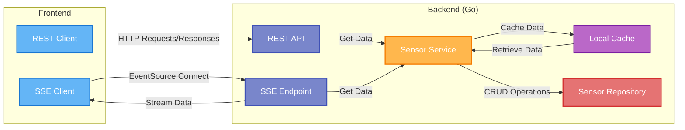
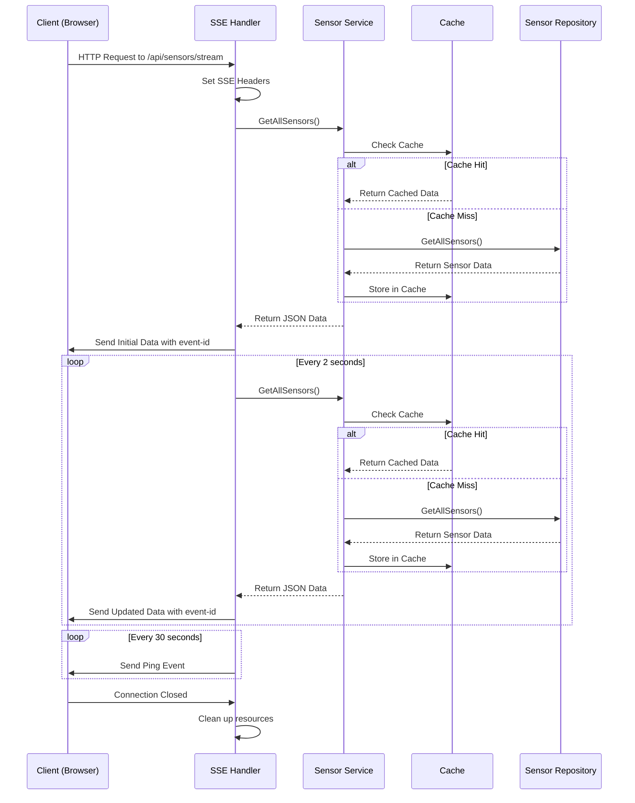
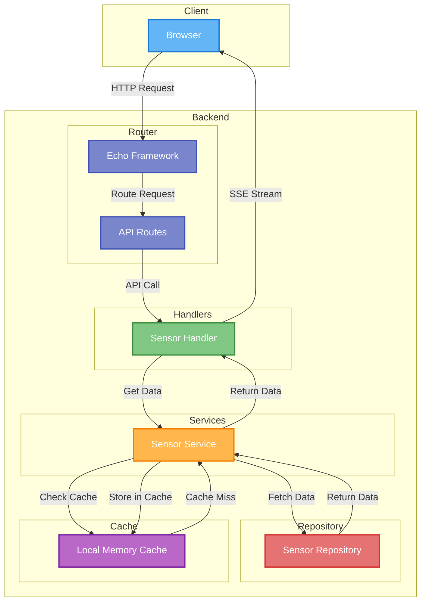
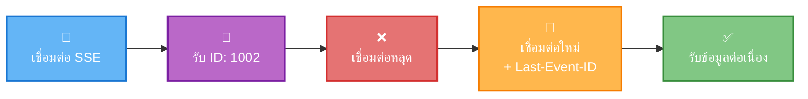
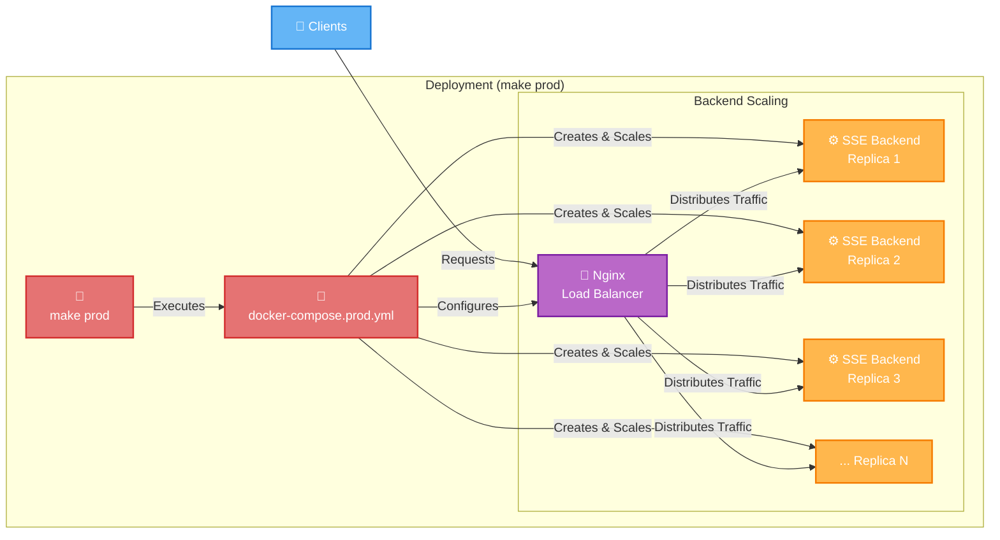

# go-sse-sensor-dashboard-demo

## Server-Sent Events (SSE)

เป็นเทคโนโลยีที่ช่วยให้เซิร์ฟเวอร์สามารถส่งข้อมูลแบบเรียลไทม์มายังเว็บเบราว์เซอร์ของผู้ใช้งานผ่านการเชื่อมต่อ HTTP ที่เปิดไว้เพียงครั้งเดียว โดยไม่จำเป็นต้องให้ไคลเอนต์ส่งคำขอใหม่ซ้ำๆ SSE ถูกออกแบบมาเพื่อการสื่อสารทิศทางเดียว (one-way communication) จากเซิร์ฟเวอร์ไปยังไคลเอนต์ ทำให้เหมาะสำหรับการส่งการอัปเดตแบบ real-time เช่น การแจ้งเตือน, ข้อมูลตลาดหุ้น, อัพเดทสถานะ หรือ feed ข่าวสด เป็นต้น

ด้วยการทำงานบนพื้นฐานของโปรโตคอล HTTP ทั่วไป ทำให้ SSE มีความเรียบง่ายในการใช้งานและการติดตั้ง โดยไม่จำเป็นต้องใช้โปรโตคอลพิเศษหรือการตั้งค่าเซิร์ฟเวอร์ที่ซับซ้อน แต่ก็มีรายละเอียดเพิ่มเติมเฉพาะด้านเช่น สามารถใช้ HTTP/2 เพื่อเพิ่มประสิทธิภาพได้...[อ่านเพิ่มเติมเกี่ยวกับ SSE](docs/sse.md)



การทำ **load test SSE endpoint** มีรายระเอียดที่ควรพิจารณาเพิ่มเติมจากการทำ loadtest บน REST API endpoint ปกติ
สามารถอ่านเพิ่มเติมได้ที่ [การทำ load test SSE endpoint](docs/sse-loadtest.md)

ดูตัวอย่างการใช้ k6 ร่วมกับ plugin k6-sse สำหรับการทดสอบ loadtest และ tuning loadbalancing ด้วย Nginx – คลิกที่ [Loadtest ด้วย k6-sse](#loadtest-ด้วย-k6-sse)

```mermaid
graph LR
    K6[k6 มาตรฐาน<br>❌ ไม่รองรับ SSE]
    XK6[xk6<br>k6 extension builder]
    SSE[xk6-sse<br>SSE extension]
    CustomK6[Custom k6<br>✓ รองรับ SSE]
    LoadTestSSE[Load Test<br>ทดสอบ SSE Server]
    
    K6 -->|ข้อจำกัด| XK6
    XK6 -->|ใช้งาน| SSE
    SSE -->|รวมเข้ากับ k6| CustomK6
    CustomK6 -->|ใช้ทำ| LoadTestSSE
    
    classDef standard fill:#E57373,stroke:#D32F2F,stroke-width:2px,color:#fff
    classDef builder fill:#64B5F6,stroke:#1976D2,stroke-width:2px,color:#fff
    classDef extension fill:#81C784,stroke:#388E3C,stroke-width:2px,color:#fff
    classDef custom fill:#FFB74D,stroke:#F57C00,stroke-width:2px,color:#fff
    classDef test fill:#BA68C8,stroke:#7B1FA2,stroke-width:2px,color:#fff
    
    class K6 standard
    class XK6 builder
    class SSE extension
    class CustomK6 custom
    class LoadTestSSE test
```



ตัวอย่าง SSE Messages

```plaintext
id: 1625482456
event: message
data: {"server_id":"container-a1b2c3","data":[{"id":"temp1","name":"อุณหภูมิห้อง 1","type":"temperature","value":25.7,"unit":"°C","timestamp":1625482456},{"id":"hum1","name":"ความชื้นห้อง 1","type":"humidity","value":65.3,"unit":"%","timestamp":1625482456}]}
```

- `id`: เป็น Unix timestamp ปัจจุบัน ซึ่งใช้เป็น Event ID สำหรับติดตามและการเชื่อมต่อใหม่
- `event`: ประเภทของข้อความ: "message" สำหรับข้อมูลปกติ, "ping" สำหรับรักษาการเชื่อมต่อ
- `data`: ข้อมูล JSON ที่ประกอบด้วย:
  - `server_id`: รหัสเซิร์ฟเวอร์ที่ส่งข้อมูล (ช่วยในการสังเกตว่าข้อมูลมาจากเซิร์ฟเวอร์ตัวไหนในกรณีมีหลายตัว)
  - `data`: อาเรย์ของข้อมูลเซนเซอร์






### ตัวอย่างการใช้งาน Event ID ใน SSE

เมื่อการเชื่อมต่อถูกตัด และมีการเริ่มการเชื่อมต่อใหม่ไปยัง sse endpoint  
client ในฝั่งเบราว์เซอร์จะส่ง ID ล่าสุดที่ได้รับไปไว้ในส่วนหัว `Last-Event-ID`  
เมื่อฝั่ง server ได้รับค่าดังกล่าวก็จะสามารถทราบได้ว่า client นี้เคยได้รับข้อความอะไรไปแล้วบ้างก็จะสามารถเลือกส่งข้อมูลไปให้ client ได้ตาม logic ที่ต้องการ  



ตัวอย่างการตรวจสอบ Last-Event-ID ที่ฝั่ง server ทำได้ดังนี้

```go
// ตรวจสอบ Last-Event-ID จาก request header (ถ้ามี)
lastEventID := c.Request().Header.Get("Last-Event-ID")
var lastTimestamp int64

if lastEventID != "" {
    // แปลง string เป็น int64
    var err error
    lastTimestamp, err = strconv.ParseInt(lastEventID, 10, 64)
    if err != nil {
        h.logger.Warn("Invalid Last-Event-ID received",
            zap.String("last_event_id", lastEventID),
            zap.Error(err))
    } else {
        h.logger.Info("Reconnection with Last-Event-ID",
            zap.Int64("last_event_id", lastTimestamp),
            zap.String("client_ip", c.RealIP()))
    }
}
```

### การรับ SSE จากเซิร์ฟเวอร์ในฝั่งฟรอนต์เอนด์

ฝั่งฟรอนต์เอนด์ใช้ JavaScript ในการเชื่อมต่อและรับข้อมูล SSE ดังนี้:

```javascript
// สร้าง function สำหรับ SSE connection พร้อม retry
function connectSSE() {
    console.log('Connecting to SSE...');
    
    // แสดงสถานะกำลังโหลด
    document.getElementById("temperature").textContent = "กำลังโหลด...";
    document.getElementById("humidity").textContent = "กำลังโหลด...";
    document.getElementById("timestamp").textContent = "กำลังเชื่อมต่อ...";
    document.getElementById("server-id").textContent = "กำลังรอข้อมูล...";
    
    const eventSource = new EventSource('/api/sensors/stream');
    
    eventSource.onopen = function() {
        console.log('SSE connection established');
    };

    eventSource.onmessage = function(event) {
        try {
            // แปลงข้อมูล JSON
            let data = JSON.parse(event.data);
            
            // แสดง server ID เพื่อเห็นว่าข้อมูลมาจากเซิร์ฟเวอร์ตัวไหน
            if (data.server_id) {
                document.getElementById("server-id").textContent = data.server_id;
            }
            
            // อัปเดตค่าบนหน้าจอ
            if (data.data && Array.isArray(data.data) && data.data.length > 0) {
                // อัปเดตแดชบอร์ด
                updateDashboardCards(data.data);
                // อัปเดตกราฟ
                updateCharts(data.data);
                // แสดงรายการเซนเซอร์
                displaySensorsList(data.data);
            }
        } catch (error) {
            console.warn("Error processing sensor data:", error);
        }
    };

    eventSource.onerror = function(error) {
        console.error('SSE connection error:', error);
        document.getElementById("server-id").textContent = "ขาดการเชื่อมต่อ";
        // การเชื่อมต่อใหม่จะถูกจัดการโดยเบราว์เซอร์โดยอัตโนมัติ
    };
    
    return eventSource;
}
```

เมื่อไคลเอนต์เชื่อมต่อใหม่ เบราว์เซอร์จะส่ง `Last-Event-ID` ไปยังเซิร์ฟเวอร์โดยอัตโนมัติ เพื่อให้เซิร์ฟเวอร์ทราบว่าไคลเอนต์ได้รับข้อมูลสุดท้ายคืออะไรและตอบสนองได้อย่างถูกต้อง

## การควบคุมเวลาสูงสุดของ SSE connection

**ที่ฝั่ง server** มีการตั้งค่าเวลาสูงสุดของ SSE connection ไว้ที่ `APP_WRITE_TIMEOUT` เท่ากับ 10 นาที  
ซึ่งค่านี้จะถูกนำไปตั้งค่าให้กับ `WriteTimeout` ของ Echo Web Framework เพื่อควบคุมเวลาสูงสุดของ SSE connection
การตั้งค่านี้เพื่อป้องกันในกรณีที่ client ไม่ยอมปิด connection ซึ่งอาจทำให้ server รอคอยการปิด connection นานเกินไป

การจัดการที่ฝั่ง client ถ้า connection ถูกปิดโดยฝั่ง server ก็ค่อยทำการเชื่อมต่อใหม่อีกครั้งโดยสามารถแจ้ง server ได้ว่าเคยได้รับ `Last-Event-ID` อะไรไปแล้วบ้างเพื่อทำงานตาม logic ที่ต้องการได้

## การติดตั้งและใช้งาน

### ขั้นตอนการติดตั้ง

1. Clone repository:

   ```sh
   git clone https://github.com/yourusername/go-sse-demo-sensor-dashboard.git
   cd go-sse-demo-sensor-dashboard
   ```

2. ติดตั้ง dependencies

   ```sh
   go mod tidy
   ```

3. ติดตั้งเครื่องมือสำหรับการพัฒนา

   ```sh
   make install-dev-tools
   ```

### การตั้งค่า Configuration

โปรเจคนี้ใช้ไฟล์ configuration แยกตามสภาพแวดล้อมแบบเฉพาะเจาะจง:

- `.env.dev`: สำหรับสภาพแวดล้อม development
- `.env.uat`: สำหรับสภาพแวดล้อม UAT
- `.env.prod`: สำหรับสภาพแวดล้อม production

### Makefile

โปรเจคนี้มีคำสั่ง make หลักที่ใช้งานดังนี้

- **`make`**: เทียบเท่ากับ `make run` คือรันแอพพลิเคชันในโหมด development โดยตรงบนเครื่องโฮสต์ (ไม่ผ่าน Docker) พร้อม hot-reload
  - เข้าถึงได้ที่: <http://localhost:8080>
  - ข้อดี: พัฒนาได้รวดเร็ว มี hot-reload
  - ใช้เมื่อ: ต้องการพัฒนาโดยเห็นการเปลี่ยนแปลงทันที

- **`make dev`**: รันแอพพลิเคชันในโหมด development ผ่าน Docker container พร้อม hot-reload
  - เข้าถึงได้ที่: <http://localhost:8081>
  - ข้อดี: มี hot-reload เหมือน `make run` แต่รันในสภาพแวดล้อม Docker ที่ควบคุมได้
  - ใช้เมื่อ: ต้องการพัฒนาในสภาพแวดล้อมแบบเดียวกับที่จะ deploy

- **`make uat`**: รันแอพพลิเคชันในโหมด UAT ผ่าน Docker container
  - เข้าถึงได้ที่: <http://localhost:8082>
  - ข้อดี: เหมือนกับสภาพแวดล้อมจริงแต่ไม่มี load balancing
  - ใช้เมื่อ: ต้องการทดสอบแอพพลิเคชันก่อนขึ้น production

- **`make prod`**: รันแอพพลิเคชันในโหมด Production ผ่าน Docker container พร้อม Nginx reverse proxy และ load balancing
  - เข้าถึงได้ที่: <http://localhost:8083>
  - ข้อดี: จำลองการทำงานเหมือนสภาพแวดล้อมจริงทั้งหมด รวมถึงมี load balancing ด้วย Nginx
  - ใช้เมื่อ: ต้องการทดสอบแบบเต็มรูปแบบรวมถึง load balancing

สรุปความแตกต่างระหว่างคำสั่งต่างๆ

| คำสั่ง | สภาพแวดล้อม | Docker | Hot-reload | Load Balancing | พอร์ต |
|-------|-------------|--------|------------|----------------|-------|
| `make` หรือ `make run` | dev | ❌ | ✅ | ❌ | 8080 |
| `make dev` | dev | ✅ | ✅ | ❌ | 8081 |
| `make uat` | uat | ✅ | ❌ | ❌ | 8082 |
| `make prod` | prod | ✅ | ❌ | ✅ (Nginx) | 8083 |

### วิธีการใช้งานแบบปกติ

โปรเจคนี้ใช้ `make` เพื่อความสะดวกในการรัน และจะตั้งค่า APP_ENV ให้อัตโนมัติ:

- **รันในโหมด Development**:
  
  ```sh
  make run
  ```

- **รันด้วย Hot-reload ใน Docker**:

  ```sh
  make dev
  ```

- **รันในโหมด UAT**:

  ```sh
  make uat
  ```

- **รันในโหมด Production**:

  ```sh
  make prod
  ```

- **รันการทดสอบ**:

  ```sh
  make test
  ```

- **รันการทดสอบพร้อมรายงานความครอบคลุม**:

  ```sh
  make test-coverage
  ```

- **ดูคำสั่งที่มีทั้งหมด**:

  ```sh
  make help
  ```

- **หยุด containers**:

  ```sh
  make docker-stop
  ```

- **ล้าง Docker resources**:

  ```sh
  make docker-clean
  ```

## สภาพแวดล้อมการทำงาน

โปรเจคนี้รองรับ 3 สภาพแวดล้อมการทำงาน โดยแต่ละสภาพแวดล้อมจะถูกควบคุมด้วย APP_ENV:

1. **Development (dev)**: สำหรับการพัฒนา มี hot-reload และการ debug
   - รันโดย: `make run` หรือ `make dev`
   - ใช้ `APP_ENV=dev` และไฟล์ configuration: `.env.dev`
   - เส้นทาง static เริ่มต้น: `../frontend/static`

2. **User Acceptance Testing (uat)**: สำหรับการทดสอบก่อนขึ้น production
   - รันโดย: `make uat`
   - ใช้ `APP_ENV=uat` และไฟล์ configuration: `.env.uat`
   - เส้นทาง static เริ่มต้น: `/app/frontend/static` (ใน Docker)
   - พอร์ต: 8082 (เมื่อรันผ่าน Docker)

3. **Production (prod)**: สำหรับการใช้งานจริง
   - รันโดย: `make prod`, `make start`, หรือ `make docker-run-prod`
   - ใช้ `APP_ENV=prod` และไฟล์ configuration: `.env.prod`
   - เส้นทาง static เริ่มต้น: `./frontend/static` (เมื่อรันด้วย `make start`) หรือ `/app/frontend/static` (ใน Docker)
   - พอร์ต: 8083 (เมื่อรันผ่าน Docker) พร้อม Nginx load balancing
   - มีการทำ load balancing ด้วย Nginx ระหว่าง 3 instances ของแอพพลิเคชัน

## Nginx Load Balancing



เมื่อรันด้วยคำสั่ง `make prod` ระบบจะสร้าง

1. Nginx reverse proxy (1 instance)
2. แอพพลิเคชัน backend (3 instances)

เราสามารถทดสอบการทำงานของ load balancing ได้โดยเปิดหน้าเว็บที่ <http://localhost:8083> และสังเกต `server_id` ที่แสดงบนหน้าจอเมื่อรีเฟรชหน้าเว็บหลายๆ ครั้ง - เราก็จะเห็น server_id เปลี่ยนไประหว่าง instances ทั้ง 3 ตัว

## Loadtest ด้วย k6-sse

```sh
cd loadtest/k6-sse

# สำรวจคำสั่งต่างๆ
cat Makefile

# สร้าง k6 binary with SSE plugin(k6-sse)
make build-loadtest 

### loadtest dev env (อย่าลืมรัน app ด้วย make dev)
make loadtest-dev

### loadtest uat env (อย่าลืมรัน app ด้วย make uat) 
make loadtest-uat

### loadtest prod env (อย่าลืมรัน app ด้วย make prod)
make loadtest-prod
```

ตัวอย่าง loadtest result


* โดยทั่วไปเราควรจะค่อยๆ rampup vu ขึ้นไปนะ

### Turning

[**Nginx** config](configs/nginx/nginx.prod.conf)

ค่าโดย default ของ nginx ไม่ค่อยเหมาะกับ sse endpoint ต้องปรับแต่งค่าเพิ่มเติม

```nginx.conf
    # SSE endpoint 
    location /api/sensors/stream {
        access_log off;     # ปิดการบันทึก log เพื่อปรับปรุงประสิทธิภาพในกรณีที่มีจำนวนมาก
        
        proxy_pass http://backend;
        proxy_set_header Host $host;
        proxy_set_header X-Real-IP $remote_addr;
        proxy_set_header X-Forwarded-For $proxy_add_x_forwarded_for;
        proxy_set_header X-Forwarded-Proto $scheme;

        # การตั้งค่าสำหรับ SSE
        proxy_buffering off;                # ปิดการ buffer เพื่อให้ข้อมูลถูกส่งทันที
        proxy_cache off;                    # ปิดการใช้ cache
        proxy_http_version 1.1;             # ใช้ HTTP 1.1
        proxy_set_header Connection "";     # ปิด keep-alive จาก client เพื่อรองรับ long polling

        # เพิ่ม timeouts สำหรับ long connections
        proxy_read_timeout 3600s;           # อนุญาตให้การเชื่อมต่อคงอยู่ได้นาน
        proxy_connect_timeout 300s;
        proxy_send_timeout 300s;
    }

```

[**Linux** ulimits](docker-compose.prod.yml)

```yml
    ulimits:
      nofile:
        soft: 65536
        hard: 65536
```

## References

- [Server-Sent Events (SSE)](https://developer.mozilla.org/en-US/docs/Web/API/Server-sent_events)
- [K6 loadtest tutorial](https://github.com/Napat/k6_loadtest/tree/master)
- [k6-sse extension](https://github.com/phymbert/xk6-sse/)
- [Nginx Load Balancing](https://www.nginx.com/resources/glossary/load-balancing/)
